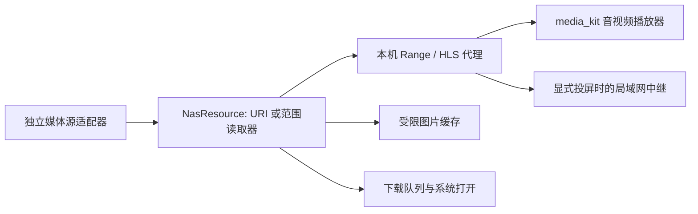

# NAS 媒体库与流播放架构

## 范围与当前状态

2026-09-23：NAS 已从 SSH 服务器附属页面扩展为独立媒体源。图片、视频、音频复用成熟协议库与原生播放器；本地索引、浏览和播放按页或按需读取，不要求把整个远端媒体库或媒体文件载入内存。展示层由 Antigravity 维护，业务层遵循项目既有 Riverpod / Service / Repository 分层。

本文描述当前源码及已取得的验证证据。最终静态分析无问题、全量 1009 项 Flutter 测试通过，Android / Linux debug 构建成功；Android 模拟器已完成正常覆盖安装、NAS 集成测试、后台系统播放控制及最终 APK 的列表 / 视频画面复验。模拟器和协议测试不等同于真实手机、电视及所有桌面平台验收；其余细项交互复验进度见 [实施状态](../03-development/04-implementation-status.md)。

## 独立媒体源与适配器

[`NasSource`](../../lib/data/models/nas_source.dart) 以独立 `sourceId` 标识媒体库，保存类型、端点、根目录和可选 SSH 连接 ID；NAS 当前选择独立于仪表盘的活动 SSH 服务器。源配置不包含密码或 token，秘密由安全存储按源隔离。旧索引的 `server_id` / `path` 列保持兼容，业务语义为源 ID / 条目 ID；媒体服务器不透明 ID 与显示用 `sourcePath` 分开保存。

[`nas_sources_provider.dart`](../../lib/core/providers/nas_sources_provider.dart) 统一创建适配器，保存前可探测连接，也能单独探测而不保存。异步扫描、播放、下载及同步捕获源身份，不从全局活动服务器推断目标。

| 来源 | 复用组件与扫描方式 | 播放与状态归属 |
| --- | --- | --- |
| SSH / SFTP | `dartssh2`；SSH 原始 stdout 经增量 UTF-8 / NUL 解析；GNU find 不支持时使用便携 find + stat 路径 | SFTP 范围读取；收藏、列表与进度存在本地索引 |
| WebDAV / HTTP(S) | 标准 HTTP、`xml` 流式解析 PROPFIND；目录遍历队列落临时文件，媒体分批输出；直接媒体 URL 用 HEAD 建单条索引 | 原文件 Range；HTTP 静态目录没有通用列举协议，不宣称支持任意 HTML 目录页 |
| SMB | [`valhalla_smb`](../../packages/valhalla_smb/README.md) 封装成熟 `libsmb2`，原生分页遍历、64 位偏移和可取消读取 | SMB 范围读取经本机代理；不自行实现 SMB 握手、签名或加密 |
| Jellyfin / Emby | 官方服务 API；分页扫描图片、视频、音频及服务端元数据 | 原文件或 PlaybackInfo 转码 / HLS；收藏、播放列表和播放进度通过各自 API 同步 |

不同媒体服务器的认证、列表更新及播放会话路由分别适配。播放列表项使用服务端成员 ID，不把媒体 ID 当作每次出现的唯一标识；服务端对重复曲目返回歧义 ID 时拒绝不确定的删除或排序。失败不会静默改用另一媒体源或自动安装服务。

## 索引、扫描与大媒体库

[`NasIndexRepository`](../../lib/data/repositories/nas_index_repository.dart) 使用 SQLite WAL、绑定参数、后台 isolate 和串行写入队列。此处沿用 [工程规则中的 SQLite 兼容例外](../00-rules/01-project-engineering-rules.md)，不扩散到其他存储。

- `beginScan` 分配代次，`upsertBatch` 事务写入小批数据并保留收藏、进度等用户状态；仅成功的 `finishScan` 删除本代未见条目。取消或失败不清空旧媒体库，排队等待的清理在执行前再次检查取消状态。
- 本地媒体页按修改时间与路径组合游标进行 keyset 查询，默认每页 200 项；深页不使用线性 OFFSET。总量、分类、收藏、目录、歌手和专辑由数据库查询，页面不读取全库后再分组。
- 搜索使用转义后的 FTS5 token 前缀匹配，不通过前导通配符扫描每一行；它不是任意字符串中段匹配。分类、收藏、目录、歌手、专辑和搜索可以组合筛选。
- 本地播放列表支持创建、改名、删除、追加、移除、排序及成员分页；远程列表调用对应服务 API。列表详情查询实际成员，不把整个媒体库作为播放列表。
- SFTP、DAV、SMB 和服务端 API 分批向索引供给数据；取消会停止当前通道或请求。播放器队列分页补充并保留有界窗口，随机播放以当前窗口为单位，不声称对百万曲目做全局均匀洗牌。

### 未播放音乐的元数据

[`NasMetadataService`](../../lib/core/services/nas_metadata_service.dart) 从 SQLite 待探测队列每次读取最多 32 首音频，以独立的暂停、静音 `media_kit` / libmpv 实例读取标题、歌手、专辑、曲序和时长，不实现自定义音频标签解析器。Jellyfin / Emby 直接使用服务端元数据，跳过本地探测。

单文件读取共享 3 MiB 上限，上游范围每次最多 64 KiB，探测等待限时 10 秒；小文件可能完整落在该上限内，但不会缓存整个音乐库。显式限定音频容器解析器并禁止引用外部媒体。标签数量、长度、解复用缓冲均有限制。

失败记录本次尝试，避免反复探测同一坏文件；再次扫描可重试失败记录，大小或修改时间改变时重新探测。写回校验文件指纹，保留收藏和扫描代次。开始前以及单文件失败后探测源连接，断线不把余下文件全部标记为坏文件。应用进入后台或切换源时取消，回到前台继续，已保存标签保留；此生命周期不停止用户正在收听的播放器。文件格式、标签位置或读取预算不允许时可以缺少标签，不能保证每个文件都得到完整元数据。

### 百万条合成索引基准

可复现入口：[`tool/nas_index_benchmark.dart`](../../tool/nas_index_benchmark.dart)，命令 `dart run tool/nas_index_benchmark.dart 1000000`。基准只使用独立临时数据库，不打开应用数据。

当前最终索引结构（含元数据队列索引）已重跑：Linux x64 / Dart 3.10.0 / 16 逻辑处理器环境，100 万条合成音频索引，每批 5000 条，每种查询重复 20 次：

| 查询 | P50 | P95 |
| --- | --- | --- |
| 首页 | 1.467 ms | 2.352 ms |
| 95% 深度游标页 | 1.230 ms | 1.662 ms |
| 稀有 token 前缀 | 99.266 ms | 111.497 ms |
| 常见 token 前缀 | 113.357 ms | 143.518 ms |
| 分类总量 | 90.210 ms | 107.055 ms |

写入耗时 90.905 秒，数据库 1,345,769,472 字节，采样进程 RSS 峰值 278,683,648 字节。最终报告与写入日志分别保存在本轮环境 `/tmp/valhalla-nas-index-benchmark-final.json`、`/tmp/valhalla-nas-index-benchmark-final.log`，旧报告 `/tmp/valhalla-nas-index-benchmark.json` 保留；临时文件不是仓库交付物。该结果验证当前索引结构的本地查询表现，不代表冷缓存、手机帧率、真实远端扫描速度或完整百万首标签探测耗时。

## 流代理、HLS 与图片



[`NasMediaProxyService`](../../lib/infrastructure/nas/nas_media_proxy_service.dart) 默认仅监听 loopback，使用随机、可撤销且有时效的 URL token；支持 GET、HEAD、单 Range 和 suffix Range，非法范围返回 416，响应使用具体 MIME 类型。代理限制活动请求和 token 数量，流传输保持背压。SFTP 一个范围请求复用文件句柄及成熟库流水线读取；播放不写完整视频缓存。

带认证或查询凭据的远程 URL 留在适配器 / 代理内，播放器及投屏设备取得局部授权地址。HTTP 请求检查 origin、重定向和 Content-Range，不把认证头带到另一主机。仅无需认证且符合直连条件的资源可直接播放。

[`NasHlsRelayService`](../../lib/infrastructure/nas/nas_hls_relay_service.dart) 改写 master / variant、分片与带 URI 的播放列表引用，维护同源边界；子地址使用成熟密码库生成经过认证的加密令牌，服务端 query token 不直接暴露给播放器或电视。分片流式转发，播放列表、会话和并发均有上限，不积累无限分片映射。停止、切源或取消会撤销中继和上游请求。

图片使用按源、条目和修改时间区分的受限缓存；有媒体服务缩略图时优先取服务端资源。图片预览与主动下载是独立用途，不用图片缓存替代音视频流播放。

## 播放器与系统媒体控制

[`NasMediaPlayerService`](../../lib/core/services/nas_media_player_service.dart) 持有一套用户播放用 `media_kit` 原生播放器和队列，串行提交原生命令，以代次保护快速切曲及切源。支持播放 / 暂停、跳转、上下首、重复、窗口内随机、倍速、音轨、字幕轨道和媒体服务画质选择。服务端可用时读取续播位置并同步 start / progress / stop；本地进度节流写入 SQLite。后台标签探测器是独立暂停任务，不拥有用户播放队列。

[`NasAudioHandler`](../../lib/core/services/nas_audio_handler.dart) 将系统命令转发到同一播放器，不创建第二套正在播放的音频队列：Android / iOS / macOS 使用 `audio_service` 与 `audio_session`，Windows 使用固定版本 `smtc_windows`，Linux 复用 `audio_service_mpris` 的生成接口和 `dbus`。系统媒体信息、暂停 / 播放、跳转与队列操作随当前曲目更新。各平台声明和代码接入不等于该平台已完成原生验收，后台持续能力仍受操作系统和网络生命周期约束。

Android 模拟器在应用后台接收系统 MediaSession 的后退、播放、暂停和停止命令已有实测记录。播放 / 暂停状态与位置同步，曲目元数据显示 `NAS test track / Valhalla / Fixture`，停止后会话变为 `active=false`、状态 `NONE` 且位置归零。证据为 [后台媒体控制记录](../../build/nas-validation/android-media-controls.txt)。这项验证不包含物理手机、耳机拔插、音频焦点竞争或进程被系统杀死后的行为。

### Android 模拟器视频黑屏兼容处理

本轮 Android 14 x86_64 模拟器曾出现音频与进度正常、视频区域全黑。原生日志将原因定位到捆绑 libmpv 的 GLES 上下文创建：向模拟器 EGL 1.4 传入 `EGL_CONTEXT_FLAGS_KHR=0` 后返回 `0x3004 (EGL_BAD_ATTRIBUTE)`，视频输出初始化失败。独立 NDK 探针对比确认相同配置去掉该属性后创建成功，返回 `0x3000`。详见 [EGL 参数探针](../../build/nas-validation/android-egl-flags-proof.txt) 与 [播放器失败日志](../../build/nas-validation/android-video-black-screen-proof.txt)。上游也有同类模拟器黑屏 / EGL 错误报告；本项目的具体属性因果以本地探针为依据。[media-kit issue #1343](https://github.com/media-kit/media-kit/issues/1343)

当前 `nasVideoConfiguration()` 复用 `media_kit_video` 的 `Utils.IsEmulator` 检测，仅 Android 模拟器选择 `VideoControllerConfiguration(vo: 'mediacodec_embed', hwdec: 'mediacodec')`，通过原生 MediaCodec surface 绕过失败的 EGL 路径。Android 实机及其他平台保持库的默认视频配置。`NasMediaPlayerService.videoController` 在播放器生命周期中共享同一 controller，[`nasVideoControllerProvider`](../../lib/core/providers/nas_provider.dart) 将其提供给播放器界面，避免重新打开弹窗时重复创建输出。原生 fatal / 视频输出错误同时映射为 `NAS_PLAYBACK_FAILED`，不再只呈现持续黑屏。

同一已安装 APK 的可逆原生配置探测先取得 [彩色视频帧截图](../../build/nas-validation/video-native-output-proof.png)，证明 MediaCodec 路径能够出画。共享 controller 与 UI 整合后的最终默认入口 APK 已构建并通过 `adb install -r` 正常覆盖安装，实际复验 [应用内彩色视频](../../build/nas-validation/10-final-video.png) 和 [横屏全屏视频](../../build/nas-validation/11-final-video-fullscreen.png) 均已出画；[窄屏媒体库列表](../../build/nas-validation/09-final-library.png) 正常，来源与媒体索引保留。此兼容路径受模拟器原生编解码器支持范围限制，不能承诺默认软件解码路径的全部格式；未据此宣称 Android 实机或 Apple / Windows 视频已通过。上述 `build/nas-validation` 是本轮本地证据目录，会随构建清理而消失。

## 投屏与下载

[`NasCastService`](../../lib/core/services/nas_cast_service.dart) 复用 `upnp_client` 的 SSDP、SOAP 与 DLNA MediaRenderer 控制，支持发现、播放、暂停、停止、进度和音量。只有用户启动投屏时才在通往设备的具体局域网接口建立临时 Range / HLS 中继；停止撤销 token、连接和监听。需要认证或仅手机可访问的来源由手机中继，电视不会得到 NAS 凭据。它是前台 DLNA 控制器，不是 Chromecast / AirPlay 实现，也不保证移动系统挂起后中继持续可用。真实电视兼容性尚未验证。

[`NasDownloadService`](../../lib/core/services/nas_download_service.dart) 统一调用源适配器，最多两个并行下载，任务列表有界；提供进度、取消、失败重试和完成后打开。文件写入 `.part`，校验大小并成功关闭后才重命名，目标重名保留保护。系统打开使用完成后的本地文件，不传手机 loopback URL 给外部应用。当前 NAS 队列是进程内任务，取消后的重试重新下载；不宣称跨进程断点续传或离线镜像同步。

## 可选部署向导与 SSH HTTP 隧道

NAS 使用已有服务不需要安装 Valhalla 专有守护进程。用户也可主动选择可选的 [`NasInstallService`](../../lib/core/services/nas_install_service.dart) 向导，部署官方 Jellyfin、Emby 或 rclone WebDAV；此能力必须经过运行时预览与明确确认，不由连接失败触发。

1. 通过捕获的 SSH 连接只读探测 Linux、Docker / Compose、工具、主机身份、路径、目录权限、容器名和端口占用。缺 Docker / Compose 等前提时给出指导，不静默安装操作系统依赖。
2. 预览确切镜像、媒体 / 数据路径、只读媒体挂载、绑定地址、端口、Compose 和操作步骤。镜像使用固定版本并确认 digest，不使用 `latest`；当前候选为 Jellyfin 10.11.11、Emby 4.10.0.40、rclone 1.75.0。
3. 安装要求与不可变计划匹配的一次性确认 token，计划 15 分钟过期；执行前再次核对主机和冲突。默认仅绑定服务器 `127.0.0.1`，不修改防火墙或公网规则。
4. 独立项目创建、拉取、启动和健康检查失败时，仅回滚带本向导身份标记的容器及创建的配置资源；保留宿主媒体、数据和既有服务。凭据不进入预览或日志。

[`NasSshTunnelService`](../../lib/infrastructure/nas/nas_ssh_tunnel_service.dart) 可将显式配置的远端 HTTP 端点通过 `dartssh2.forwardLocal` 映射到应用本机临时 loopback 端口，保留 base path 与原始 Host。源配置仍保存远端地址，临时端点不落盘；源释放或 SSH 断开时关闭监听。当前 SSH HTTP 隧道不接受 HTTPS 端点，不关闭 TLS 校验来规避证书问题。直接 HTTPS 来源不受此限制。

向导安全边界、冲突和回滚已用隔离 fixture 覆盖；本轮未在用户目标宿主机实际部署这些服务，不能把向导 fixture 视为生产部署成功。

## 本轮验证范围与剩余验收

| 项目 | 已取得证据 | 尚未证明 |
| --- | --- | --- |
| 自动化与构建 | 最终 `flutter analyze --no-pub` 无问题、全量 1009 项 Flutter 测试通过；Android 默认 `lib/main.dart` debug 构建 / 覆盖安装成功，Linux 最终 debug 构建通过 | 构建与自动化不等于其他平台设备验收；Linux 容器无 PipeWire 输出，未验证实际听音 |
| SMB | 签名 SMB2 fixture 在 Linux 实际产物及 Android 14 `sdk_gphone64_x86_64` 模拟器验证 2502 文件 / 5 页、Unicode、超过 4 GiB 偏移、取消和重连 | 真实 SMB3 NAS 与加密服务；模拟器不是物理手机 |
| Jellyfin 12.1 | 真实服务登录、三类媒体扫描、收藏、列表增删改排、12 秒续播、原始 Range、缩略图、4 Mbps PlaybackInfo、HLS master / variant 与 MPEG-TS 分片 | 不同服务器版本、硬件转码与所有编码组合 |
| Emby 4.10.0.40 | 真实服务登录、三类媒体扫描、收藏、重复列表项独立 ID 的删除 / 排序、列表改名 / 删除、12 秒续播、三类原始 Range、缩略图、4 Mbps PlaybackInfo 及 HLS / MPEG-TS；修复 JSON chunked 和原始播放会话兼容问题后，相关 30 项组合测试及真实 Jellyfin 全流程回归通过 | 不代表不同版本或硬件转码验收 |
| Android NAS 集成 | `sdk_gphone64_x86_64` 模拟器完整测试通过：原图 / 缩略图、视频流 / 跳转 / 续播 / 倍速、音乐标签、收藏 / 列表、下载及来源隔离；最终 APK 保留来源与索引，窄屏列表已目视复验 | 不代表真实物理手机；其余细项交互进度见实施状态 |
| 系统控制 | Linux 隔离真实 D-Bus 回归；Android 模拟器后台系统后退 / 播放 / 暂停 / 停止及曲目元数据同步已有实测记录 | 不代表耳机、音频焦点、物理手机或系统杀进程后的行为；Apple / Windows 无本机工具链，未做原生构建验收 |
| 模拟器视频输出 | NDK 探针定位 EGL 属性导致的 `0x3004`；模拟器限定配置及共享 controller 整合后的最终 APK 已复验应用内彩色视频与横屏全屏画面 | 模拟器可用格式受原生 codec 限制，不代表实机 / Apple / Windows 视频验证 |
| 许可证打包 | Android 最终 APK 与 Linux 最终 bundle 的 `NOTICES.Z` 均逐文件核验含完整 SMB NOTICE、libsmb2 COPYING 和 LGPL-2.1 文本 | 核验范围为这三份文本的实际产物打包，不扩展为其他发布条件结论 |
| 投屏与安装 | 中继、取消、凭据边界、向导预览 / 确认 / 冲突 / 回滚有自动化覆盖 | 没有真实 DLNA 电视验收，也未在用户服务器实际执行安装向导 |

代表性回归入口包括 `test/data/nas_index_repository_test.dart`、`test/core/nas_metadata_service_test.dart`、`test/core/nas_playback_download_proxy_test.dart`、`test/core/nas_cast_service_test.dart`、`test/core/nas_install_service_test.dart`、`test/infrastructure/nas_network_adapters_test.dart`、`test/infrastructure/nas_hls_relay_service_test.dart`、`test/infrastructure/nas_ssh_tunnel_service_test.dart` 及 [`integration_test/nas_device_test.dart`](../../integration_test/nas_device_test.dart)。测试文件存在不代表其真实设备路径已经通过；以本节证据和实施状态为准。

最终检查日志位于 `/tmp/valhalla-nas-final-analyze.log`、`/tmp/valhalla-nas-final-tests.log`、`/tmp/valhalla-nas-final-android-build.log`、`/tmp/valhalla-nas-final-install.log` 和 `/tmp/valhalla-nas-linux-build.log`。逐文件全文及哈希证据见 [Android 许可证打包证明](../../build/nas-validation/android-lgpl-license-proof.json) 与 [Linux 许可证打包证明](../../build/nas-validation/linux-lgpl-license-proof.json)。前者记录最终 `app-debug.apk` SHA-256 为 `a8a7ddd3d7d00b34c6b38fdb08834db799a49a83417aa38e51f5e04ea57b0c19`。日志、JSON 与截图均仅为本环境产物，未作为永久仓库附件分发。

### Android 集成测试重放与数据边界

**只能在无用户应用数据、允许清空的专用测试模拟器上运行 `flutter test integration_test/...`，禁止在包含用户数据的设备上执行。** 本轮观察到 Flutter integration runner 的 `kill()` 清理路径会卸载应用包，随之移除测试来源及应用数据；fixture 不会保留到随后正常安装的应用。本轮设备在测试开始前没有安装本应用，没有用户数据丢失。此行为不能用作普通安装流程。

[`tool/nas_e2e_fixture.py`](../../tool/nas_e2e_fixture.py) 在隔离 Python 环境中使用 `wsgidav`、`cheroot` 和 `imageio-ffmpeg`，生成公开测试凭据保护的只读图片、30 秒视频和带标签音乐 fixture。将服务绑定到测试模拟器可达的宿主机地址，默认端口 18086；不要指向用户媒体目录。Docker 容器中的 `127.0.0.1` 不是宿主机，ADB 和 fixture 都必须使用实际可达地址。示例中的占位地址必须替换：

```bash
python tool/nas_e2e_fixture.py --bind HOST_LAN_IP --port 18086
```

服务运行后，在另一个终端，仅对专用测试模拟器执行：

```bash
NAS_TEST_DEVICE='HOST_LAN_IP:14251'
NAS_TEST_FIXTURE_URL='http://HOST_LAN_IP:18086'
adb connect "$NAS_TEST_DEVICE"
flutter test --no-pub integration_test/nas_device_test.dart \
  -d "$NAS_TEST_DEVICE" \
  --dart-define=NAS_FIXTURE_URL="$NAS_TEST_FIXTURE_URL"
```

成功日志包含 `NAS_DEVICE_PASS` 及 `All tests passed!`，本轮记录为 `/tmp/valhalla-nas-device-test.log`。测试结束停止 fixture。需要正常安装应用时重新构建默认应用入口，使用覆盖安装保留已有数据，不运行 integration runner：

```bash
flutter build apk --debug --no-pub
adb -s "$NAS_TEST_DEVICE" install -r build/app/outputs/flutter-apk/app-debug.apk
```
